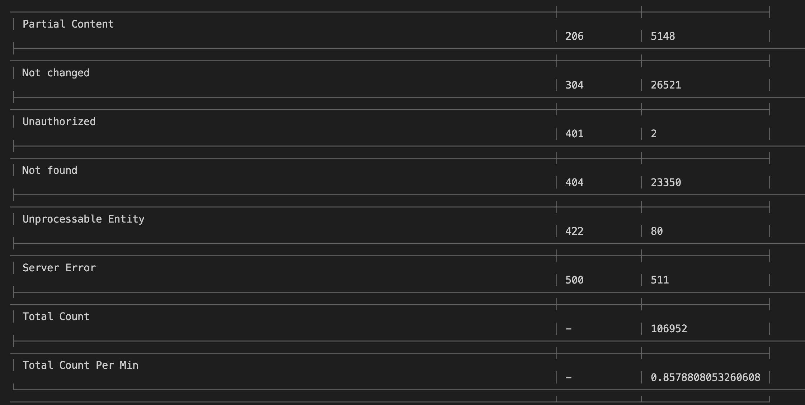

# log-analysis

## How to run
* Clone the repo: <Link>
* Go to the root directory and open the terminal then run the follwing commands:
    - npm install               ( It will install the required packages )
    - npx tsc                   ( It invokes the typescript compiler )
    - node dist/logAnalyzer.js  ( It runs the converted .js file )
* In the terminal, you can see the required table generated.

## Screen Shot Of The Output

